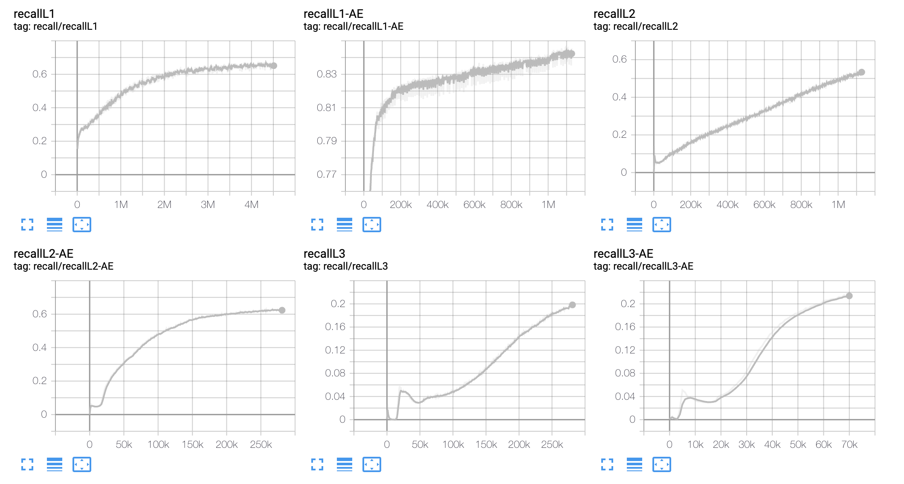

# HTM
Heterarchical Prediction Memory (HPM)


## Environment
- python 2.7


## Experiment History

### Experiment #45
- Check the effect of the context threshold
- 
### Experiment #44
- Digital Logic Device with Noisy Components

### Experiment #43
- Do not use prevprevInput 

### Experiment #42
- See the effect of the size of large NumBits and NumOnBits
- Will use 2X and 4X version of EXP-41

### Experiment #41
- Change pooling to have similarity between shifted phrases


### Experiment #40
- Use of Cupy to accelerate Numpy with GPU

### Experiment #39
- add previous letter as context
- use k=2 as feedback from higher layer

### Experiment #38
- Layer-based Memoization

### Experiment #37
- Memoization-based approach

### Experiment #36
- Increase NumBit from 512 to 2048

### Experiment #35
- Change Pooling to Sampling
- Change RELU to LeakyRELU

### Experiment #34
- Separate top-down feedback and in-layer context 

### Experiment #33
- AE with memoization 

### Experiment #32
- HTM with kWTA AE 
- For AR, use simple FC 

### Experiment #31
- Using 3 Layer LSTM
- To be continued after EXP-32

### Experiment #30
- Test of AR module with 2 FC layers

### Experiment #29
- Use kWTA for continuous embedding but close to 1 with custom loss


### Experiment #28
- Improve the character level accuracy of EXP-26
- Use kWTA for continuous embedding in hidden layers instead of ReLU

### Experiment #27
- Improve the character level accuracy of EXP-26
- Use kWTA for binary embedding in hidden layers instead of ReLU
- Result: Binary embedding did not backpropagate

### Experiment #26
- Use kWTA layer to build a sparse embedding

### Experiment #25
- Build Sparse Binary Autoencoder

### Experiment #24
- Use input argument to set the number of layers
- Use script to run multiple condition with number of layers
- Save and load models 

### Experiment #23
- Compare the performance with min char rnn
- Bit per character: 1.53

### Experiment #21 
- Used NNASE for sparse autoencoder
- To replicate 

```shell
git checkout EXP-21
conda activate hpm
python exp21.py data/old_medium.txt -n EXP-21-Old-medium -e 100000
tensorboard --logdir runs --bind_all
```




